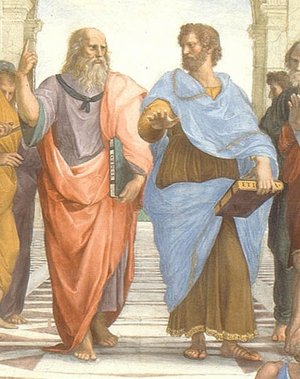

In fact, philosophy did not replace mythology. As you remember, mythology exists to this day. In this sense, <b>there are no clear boundaries between all these worldviews</b>. Plato's works are underpinned<a href="#m1" id="w1">[1]</a> by myth. According to Plato,

  <b><i>
    art is an imitation of reality
  </i></b>

  <b><i>
    It is the creation of an illusion about that reality.
  </i></b>

 
This is why there are no poets in Plato's Republic, not even poets like Homer. Because they do not tell the truth about things. They create images of objects, illusionary knowledge, which should not exist. This is why Plato was quite harsh when it came to art, even though he resorted<a href="#m2" id="w2">[2]</a> to myths. Anyway, Plato's <i>Cave</i> is probably his most famous myth. So, what is the allegory of the cave in Plato's Republic?   

  

### Allegory of the Cave
So, imagine, that we are locked in a cave forever. Moreover, we are tied to a wall, and there is only the cave wall in front of us. And even our heads are fixated in such a way that we cannot move them. We can only see the wall in front of us. Our whole life is the perception of that wall. But according to Plato, philosophers can stand up, get rid of these chains, and see what the cave is like. <b>A philosopher can see that the things we see in our lives are just shadows of images. They are not even real objects, they are signs of these objects</b>, which we can see in the picture: the fire casting shadows on that wall. Therefore, the human understanding of the world is false in its essence, because those are only sensory images of objects, not the objects themselves. Our task is to get out of that cave. 

&nbsp;&nbsp;&nbsp;&nbsp;&nbsp;&nbsp;&nbsp;&nbsp;&nbsp;&nbsp;&nbsp;&nbsp;&nbsp;&nbsp;&nbsp;&nbsp;&nbsp;&nbsp;&nbsp;&nbsp;Leaving the cave, we are blinded by the light of the good. At first, we look at that light through something. In general, it is impossible to bear this light. So, we first look at it reflected in a puddle, for example. It is practically impossible to perceive that good directly. But this good is true knowledge, full and superior. According to Plato, <b>a real philosopher is someone who has freed themselves from that cave</b>, who has left it, <b>touched the light(truth) of the good(sun), and came back to tell others the knowledge that should be shared and passed on</b>. A real philosopher must come back and tell people. It is a very powerful concept of philosophy.

&nbsp;&nbsp;&nbsp;&nbsp;&nbsp;&nbsp;&nbsp;&nbsp;&nbsp;&nbsp;&nbsp;&nbsp;&nbsp;&nbsp;&nbsp;&nbsp;&nbsp;&nbsp;&nbsp;&nbsp;Plato remarked here that the moment you come to people to tell them how the world functions, they refuse to listen to you. Their reality is the only thing they have ever known. These images on the wall are reality to them. And when you come and tell them something else, it is all fiction to them. The task of the philosopher is to break through public opinion, the misconception of reality. The task of a real philosopher is not to give up, to continue carrying the knowledge no one accepts.

### Plato's concept of Death

&nbsp;&nbsp;&nbsp;&nbsp;&nbsp;&nbsp;&nbsp;&nbsp;&nbsp;&nbsp;&nbsp;&nbsp;&nbsp;&nbsp;&nbsp;&nbsp;&nbsp;&nbsp;&nbsp;&nbsp;Let's understand Plato's concept of death and his understanding of philosophy. Plato gave much thought to what philosophy is, where it emanates from. He developed a concept of eidos - something knowing, whole, good, beautiful, and so on. It is embodied in the human body, in some sort of a dungeon<a href="#m3" id="w3">[3]</a> . Our real being is the being of eidos. And we are locked in what can be called a shell. And we interact with the world through it. It means that we live in a dream. The truth is there, where the eidos is. Life is a dream. According to Plato, death is not the end. We know that in both mythology and religion, up to the 19th and 20th centuries, death didn't mean "nothingness."

> Death is the liberation of the immortal spirit from the dungeon of the mortal body.

Even science originally attempted to unveil what comes after death, supposing there is something after death. Plato believed that there couldn't be nothingness after it. Here's what he said, 
 

  <b><i>
    "If death were the end of everything, it would be a lucky find for bad people: by dying,
  </i></b>

  <b><i>
    they would at once get rid of the body and their viciousness together with the soul".
  </i></b>

 

It means that the immortality of the human soul is perceived by Plato from the standpoint of ethics, from a moral point of view. One can commit bad acts if there is nothing after death. But if the soul remains, you just can't commit immoral actions. <b>Plato considered death as a transition to the truth</b> - the eidos. Therefore, when we finally leave our transitory bodies, we will recall everything again, and we will have full knowledge, beauty, and the good. According to Plato, philosophy has to strive for the understanding of the essence of things, for the understanding of eide. It means that we should use philosophical knowledge to escape, to leave that sensory world for the world of eide. That is to die. 

 

  <b><i>
    "Those who are devoted to philosophy are concerned with only one thing: dying and death."
  </i></b>

 

Philosophy means striving for death. This is why philosophical knowledge is the knowledge of common principles of everything, the knowledge of eidos, the knowledge behind sensuality. This way, <b>the final act of philosophy, when we actually understand everything, the final act of striving for wisdom is death</b>, when we finally leave what prevents us from knowing. Well, originally, knowledge is a guess or assimilation<a href="#m4" id="w4">[4]</a>. As it is, we only understand the sensory world. Then we express our judgments about it. Then comes reasoning - the examination of the given reality with the help of mental models. We systematize knowledge, define certain categories, structures. But the highest knowledge comes from contemplation of ideas, which, according to Plato, are eternal, inseparable, multiple, and constant.

  

 

In Plato's works, these ideas are expressed through metaphors. The good is the sun. The truth is light. Knowledge is vision. What I've said about ancient Greece is also true for Plato's works. We can notice this accent on the visible, vision, theoria.

### Plato's Ideas
1. <b>The knowledge about ideal essences is inherent<a href="#m5" id="w5">[5]</a> and innate<a href="#m6" id="w6">[6]</a></b>

&nbsp;&nbsp;&nbsp;&nbsp;&nbsp;&nbsp;&nbsp;&nbsp;&nbsp;&nbsp;&nbsp;&nbsp;&nbsp;&nbsp;&nbsp;&nbsp;&nbsp;&nbsp;&nbsp;&nbsp;The knowledge of ideal essences is a priori<a href="#m7" id="w7">[7]</a> important. 

2. **Education is just the process of remembering what was hidden because of the "birth trauma"**  
(most souls drink water from the river of oblivion before their birth)

&nbsp;&nbsp;&nbsp;&nbsp;&nbsp;&nbsp;&nbsp;&nbsp;&nbsp;&nbsp;&nbsp;&nbsp;&nbsp;&nbsp;&nbsp;&nbsp;&nbsp;&nbsp;&nbsp;&nbsp;We initially possess the knowledge of everything, we just have to recall it. Education is the process of recalling.

3. <b>About Myths & Art</b>

&nbsp;&nbsp;&nbsp;&nbsp;&nbsp;&nbsp;&nbsp;&nbsp;&nbsp;&nbsp;&nbsp;Plato criticized myth and art. You see, art is just an imitation of reality, even though he created myths and was not embarrassed by that.

  

Additionally, let me in a few words describe the concept of the state according to Plato, his ideal Republic. Plato had an idea of what a perfect state should be like. It should consist of guardians, auxiliaries<a href="#m8" id="w8">[8]</a>, and craftsmen. So, he suggested that people should be educated in the following virtues: wisdom, courage, and temperance<a href="#m9" id="w9">[9]</a>. These combinations are found in our souls and can be mainstreamed within a political regime. The <i>Allegory of the Cave</i> was also mentioned in this work to display how the good can be achieved.

### Androgyne's myth

  

The last thing that I would like to mention about Plato is, of course, the <i>Myth of the Androgyne</i> described in the <i>Symposium<a href="#m10" id="w10">[10]</a>,</i> which you should definitely read. Long story short, initially, the human being was whole and had two heads, four arms, four legs. It was so powerful that it started to argue with gods. For which, it was split into two halves. This is how two halves appeared and were destined to look for one another to regain their initial might and power. In many ways, this is the <b>origin of the story about the search for one's better half</b> which appeared in Plato's writings. But let us move on to his disciple, the teacher of Alexander of Macedon.

### ARISTOTLE (around 384 BC - 322 BC)

&nbsp;&nbsp;&nbsp;&nbsp;&nbsp;&nbsp;&nbsp;&nbsp;&nbsp;&nbsp;&nbsp;&nbsp;&nbsp;&nbsp;&nbsp;&nbsp;&nbsp;&nbsp;&nbsp;&nbsp;This is Aristotle, <b>the first historian of philosophy</b>. Generally, there is a question of how Aristotle interacted with Plato. But I will tell you a commonly accepted theory. Aristotle in many ways argued with his teacher. Boethius planned to translate Aristotle's works into Latin and to show that the latter actually continued Plato's ideas and accepted his views. But let us talk about how Aristotle's works were preserved (because Boethius did not translate his works). Aristotle was forgotten in the early Middle Ages and was not much discussed in Europe. His works were only preserved in Arabic countries. They were translated into the Arabic language. Later, in the 10th and 11th centuries, his treatises were brought back to Europe. They were translated into Latin, and then into European languages.

&nbsp;&nbsp;&nbsp;&nbsp;&nbsp;&nbsp;&nbsp;&nbsp;&nbsp;&nbsp;&nbsp;&nbsp;&nbsp;&nbsp;&nbsp;&nbsp;&nbsp;&nbsp;&nbsp;&nbsp;And of course, this <b>raises the question of what is left of the originals after that whole chain of translations. You need to know that when translated, a text loses at least 10 to 15% of its meaning</b>. And, generally, it is impossible to translate poetry without losing its meaning. To be fair, it is also next to impossible to translate philosophy, especially with so many interpretations. So, our understanding of Aristotle's concepts is rather vague, unfortunately. This is why there is a serious question about how his works came to be. We have his famous <i>Physics,</i> and then we have <i>Metaphysics.</i> And it is questioned whether it was Aristotle who invented the name <i>Metaphysics.</i> Maybe later writers just wrote <b>"after physics" - metaphysics</b>. Therefore, it would not be metaphysics as a concept, but rather something placed in a linear space, something coming after physics. 

  

Aristotle changed Plato's concept significantly. Remember Raphael's famous <i>School of Athens,</i> where he pictures it quite vividly: Plato points upwards, Aristotle points downwards, Aristotle speaks about this world, and Plato - about eide.

### Aristotle's Ideas

1. **Experience is the knowledge of particular things, Art is the knowledge of the universal**

&nbsp;&nbsp;&nbsp;&nbsp;&nbsp;&nbsp;&nbsp;&nbsp;&nbsp;&nbsp;&nbsp;&nbsp;&nbsp;&nbsp;&nbsp;&nbsp;&nbsp;&nbsp;&nbsp;&nbsp;This is why art had a much more privileged status for Aristotle than for Plato.

2. **For Plato, the universal, the idea comes first. But it is first the sensory and individual essence that is important to Aristotle.**

3. **Philosophy is the only free science because it exists for itself**

&nbsp;&nbsp;&nbsp;&nbsp;&nbsp;&nbsp;&nbsp;&nbsp;&nbsp;&nbsp;&nbsp;&nbsp;&nbsp;&nbsp;&nbsp;&nbsp;&nbsp;&nbsp;&nbsp;&nbsp;He reflected upon philosophy, which has only one object of study - itself.

4. **Plato is not interested in changes and motion. Aristotle reflects on it**

&nbsp;&nbsp;&nbsp;&nbsp;&nbsp;&nbsp;&nbsp;&nbsp;&nbsp;&nbsp;&nbsp;&nbsp;&nbsp;&nbsp;&nbsp;&nbsp;&nbsp;&nbsp;&nbsp;&nbsp;He says, a thing always has four causes, meaning - for every remote control, cup, phone, there are four causes. Due to formal cause, an essence has a form. Speaking of matter, there is the material cause. Then comes the source, where the movement begins, hence, the efficient cause. And the final cause is purpose. According to Aristotle, you cannot perceive things stripped of their causes. The matter is impossible without form. We always see essences as a combination of all causes.

  

The true image is a particular thing. <b>Each particular essence is Matter + Form</b>  
But matter is unfathomable<a href="#m11" id="w11">[11]</a>, we only know the essence. You cannot know the particular as the particular. Matter is impossible without the form.

&nbsp;&nbsp;&nbsp;&nbsp;&nbsp;&nbsp;&nbsp;&nbsp;&nbsp;&nbsp;&nbsp;&nbsp;&nbsp;&nbsp;&nbsp;&nbsp;&nbsp;&nbsp;&nbsp;&nbsp;Aristotle also started to systematize philosophical knowledge, differentiate between theoretical and practical philosophy. Actually, theoretical philosophy contemplates reality. The practical or the moral philosophy deals with how ethical principles can be put to work in life. Now let's discuss Aristotle's ethics. 

| Theoretical Philosophy | Practical Philosophy |
| - - - - - - - - - - - - | - - - - - - - - - - - |
| contemplative | moral |
| reality | possibility |
| the real | the necessary |

&nbsp;&nbsp;&nbsp;&nbsp;&nbsp;&nbsp;&nbsp;&nbsp;&nbsp;&nbsp;&nbsp;&nbsp;&nbsp;&nbsp;&nbsp;&nbsp;&nbsp;&nbsp;&nbsp;&nbsp;Aristotle is one of the leading representatives of the so-called Eudemonia, a central concept in Aristotelian ethics, meaning the highest human good. Aristotle's ethic is almost entirely about happiness. The goal of it is a diversified education of person. Education, as well as training, were cornerstones of Greek culture. By the way, the goal of education in ancient Greece, in general, was not to train someone to be a professional, a specialist in a certain field, but to raise a morally virtuous person. A person had to learn the rules of thinking, wording, telling, and acting. To be a virtuous person meant to fully fulfill one's potential. And there are two types of virtues: ethical and intellectual. Intellectual virtue includes contemplation, theoria, gaining knowledge about the world. And ethical virtue implies taking actions for reaching happiness. Happiness is the realization of all of that. Aristotle spoke about two types of purposes: the purpose as a means (for other purposes) and the purpose itself (happiness). Therefore, happiness is a goal in itself. Remember, what philosophy is? It is a science in itself. Generally, happiness is the activity of the mind, the energy of the mind aimed at the realization of one's virtues. Therefore, true happiness according to Aristotle is a conceptual realization of one's true essence, which strives for knowledge and contemplation. It means that happiness is understood not from the perspective of hedonism, but as an intellectual and ethical project. Additionally, I'd like to mention Aristotle's politics. He reflected upon the diversity of political forms. He united them in three groups, each containing two, and showed the most advantageous of them. Monarchy and tyranny. While in monarchy one rules for the good of many, in tyranny one rules for the good of one. Aristocracy and oligarchy are the rule of a minority. But while in aristocracy a smaller part of society serves for the good of the bigger one, under oligarchy, the majority is ruled over for the benefit of the ruling class. And in this case, Aristotle chose aristocracy. Generally, "aristos" means "noble." Polity is the rule of the conscious majority. Democracy, according to Aristotle, is the rule of a majority, but this majority is the rabble, roughly speaking. Therefore, democracy was disapproved by him. According to Aristotle, the best regime is aristocracy. I must say, Aristotle made a great contribution to poetics. In his first volume of <i>Poetics,</i> which is devoted to tragedy, he uses the word catharsis. It actually is a medical term that means "purification." And he says that we are purified after watching ancient Greek tragedies because we feel compassion for others. By feeling that, we become younger, we get stripped of our passions that hinder our mind and conscience. The tragedy is a way of purification. This is why catharsis is an elevated aesthetical word in Aristotle's vocabulary. The second volume of <i>Poetics,</i> that described comedy was not preserved, unfortunately. You may recollect, in Umberto Eco's <i>Name of the Rose,</i> they looked for the second volume of <i>Poetics.</i> But let's move on. I would like to say the last few words about ancient Greek theatre as the crystallization of the entire ancient Greek culture. Theatre most likely rose from Dionysian mysteries. These were the rituals in the name of the god Dionysus. Ancient Greek theatre attracted a wide audience. It comprised, just imagine, 50 to 80% of the male adult population. People spent five days there eating and purifying themselves with ancient Greek tragedies. Imagine some modern city that is home to 5 to 6 million people and an event gathering 3 million people. This was the scale of popularity of theatre performances that took place twice a year. Sadly enough, only fragments of ancient Greek tragedies have come down to us from those times, except for Aeschylus's <i>Oresteia</i> trilogy. We should name three classical tragedians in this regard: Aeschylus, Sophocles, and Euripides. They all have much in common: they are the three most powerful, most famous tragedians. What is so special about tragedies? The stories they tell are epic and are about heroes having exaggerated human features. They experience human problems, feelings, and passions lifted to the level of gods. Besides, theatre often involved myths. For example, Aeschylus's <i>Oresteia.</i> In essence, it continues Homer's story. Agamemnon comes back. He is killed by Clytemnestra. In the world of heroic ethics, the traditional world order is turned over. Antiquity shows the world of enduring and suffering, in which the main goal is the path itself. Remember Heracles: his feats, his path is what creates a heroic drama. The tragedy is always built according to the same principle. At first, something is destroyed. Then the heroes try to restore the order somehow. Most likely, it gets worse. But in the end, things get back to their regular course. This path from violation to stability through suffering and recovering is the path of ancient tragedy. Remember, it was almost always a myth. People knew ancient Greek songs by heart, they knew their contents and plots. When one came to see <i>Oedipus Rex</i> or <i>Oresteia</i> one knew how it would end. They wondered at how a tragedian would show the path of the hero's suffering. The action itself was what attracted the interest of the public. This is why the actions of the heroes were mostly unselfish. In connection to this, the Olympic Games were regarded as having a certain value, because they showed physical suffering in its absolute.

#### Meanings and Notes 
-  [underpin](#w1) - support  
-  [resort](#w2) - fall back  
-  [dungeon](#w3) - a strong underground prison cell, especially in a castle.  
-  [assimilation](#w4) - the process of taking in and fully understanding information or ideas  
-  [inherent](#w5) - built-in  
-  [innate](#w6) - originating in the mind  
-  [priori](#w7) - theoretical  
-  [auxiliaries](#w8) - volunteers  
-  [temperance](#w9) - self-control  
-  [Symposium](#w10) - philosophical text by Plato dated c. 385–370 BC  
-  [unfathomable](#w11) - enigmatic, incomprehensible  
-  [resort](#w12) - fall back  
-  [resort](#w13) - fall back  
-  [resort](#w14) - fall back  
-  [resort](#w15) - fall back  
